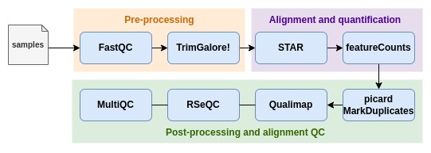

# RNA-seq Nextflow Pipeline

## Introduction
The pipeline is built using [Nextflow](https://www.nextflow.io/) (DSL2). It runs using docker containers. All the processes in the pipeline are defined as separate module scripts. These scripts can also be included and shared across other workflows.

## Pipeline Summary


Pipeline accepts sample information in CSV format. This CSV file must contain 3 columns - sampleID, file path for read-1 and file path for read-2.

## Quick start
1. Install [Nextflow](https://www.nextflow.io/docs/latest/getstarted.html#installation) (>=21.04.0)
2. Install [Docker](https://docs.docker.com/engine/install/)
3. Test the pipeline on minimal dataset.
    ```console
    nextflow run main.nf \
		--samples "$PWD/tests/samples.csv" \
		--star_indexdir "$PWD/tests/star_ref_index" \
		--reference "$PWD/tests/chr22_transcripts.fa" \
		--gtf "$PWD/tests/chr22_genes.gtf" \
		--bed "$PWD/tests/chr22.genes.bed" 
    ```
4. Start running your analysis!
    ```console
    nextflow run main.nf \
		--samples <samplesheet> \
		--star_indexdir <dirname> \
		--reference <FA file> \
		--gtf <GTF file> \
		--bed <BED file> 
    ```

## Documentation

## Usage

### **Samplesheet input**
Pipeline requires samplesheet as input. Use this parameter to specify its location. It has to be a comma-separated file with 3 columns: `sampleID`, `read1` and `read2`. Example:
| sampleID | read1 | read2 |
| -------- | ----- | ------|
| sample1  | path-to-R1.fastq.gz | path-to-R2.fastq.gz |
| sample2  | path-to-R1.fastq.gz | path-to-R2.fastq.gz |

```
--samples [path to samplesheet]
```

### **Reference genome**
The `--star_indexdir` parameter accepts the location of the directory containing the indexed (STAR) genome. Alternatively, user can also provide the location of the reference genome FASTA using `--reference` parameter. Pipeline will generate indexes for the specified genome.

### **Core nextflow arguments**
- #### `-resume`
    Specify this when restarting a pipeline.

- #### `-c`
    Specify the path to a specific config file.

### **Running Nextflow in background**
The Nextflow process must run until the pipeline is finished. You can use `-bg` option to launch _Nextflow_ in the background, so that the workflow does not stop if you log out of your session. Alternatively, you can also use `screen`.  

<br>

## Parameters
### **Input/output options**
|  |  |
| -------------------- | ----------- |
| `--samples`      | Path to the samplesheet|
| `--outdir`           | Path to the output directory where the results will be saved. [ `results` ]|
| `--tracedir`         | Path to the directory where execution reports will be saved. [ `<outdir>/pipeline_info` ]|

### **Reference genome options**
|  |  |
| ------------ | ----------- |
| `--star_indexdir` | Path to the directory containing indexed genome (using STAR) |
| `--gtf`| Path to GTF file |
| `--bed`| Path to genome bed file. BWA index should also be present at this path|

### **Genome indexing options**
|  |  |
| ------------ | ----------- |
| `--star_genomeGenerate_threads` | Number of threads to pass to STAR [ `4` ] |
> NOTE: In addition to these parameters, following parameters are provided while running the STAR genomeGenerate command: `genomeSAindexNbases 10`

### **Quality filtering and trimming options**
|  |  |
| ------------------- | ----------- |
| `--fastqc_threads`             | Number of threads to pass to FastQC [ `4` ] |
| `--trimgalore_threads`         | Number of threads to pass to TrimGalore [ `4` ] |
 
### **Alignment options**
|  |  |
| ------------ | ----------- |
| `--star_align_threads`| Number of threads to pass to STAR [ `2` ] |
| `--star_ignore_sjdbgtf`| Path to annotations GTF file [ `false` ] |

### **Read quantification options**
|  |  |
| ------------ | ----------- |
| `--featurecounts_threads`| Number of threads to pass to `featureCounts` [ `4` ] |

**Advanced Parameters**

Advanced options like changing the directory for results from a specific step, passing additional parameters to a specific tool etc. can be configured from the `conf/modules.config` file.

Users will not be able to configure these parameters from the command line directly. Modifying these parameters from the configuration file requires some knowledge of _Nextflow_.

<br>

## Results

| Directory | Description |
| --------- | --------- | 
| `01_fastqc` | QC reports for raw reads |
| `02_trimgalore`| Trimmed reads and QC reports of trimmed reads |
| `03_star_align`| Aligned reads |
| `04_read_counts` | Quantified reads |
| `05_picard_markdup` | Duplicates marked reads |
| `06_qualimap` | Qualimap reports |
| `07_rseqc` | RSeQC reports |
| `08_multiqc` | MultiQC report |
| `pipeline_info`| Execution reports |

<br />

---
**NOTE**

This pipeline was developed with intention to create basic structure which shall later be molded to accomodate specific requirements.

---